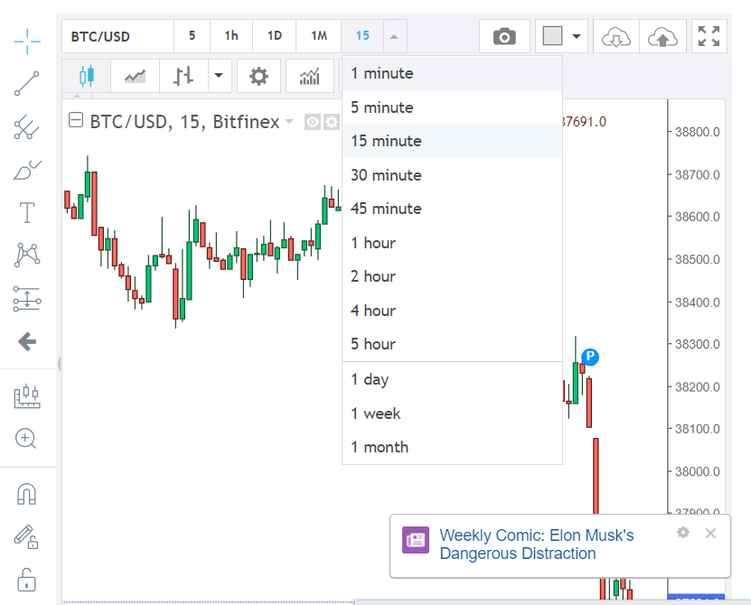

**english version follows**

# Notebook s příklady fungování aplikace 

[app/playground.ipynb](app/playground.ipynb)

# Popis

Tato práce se zabývá problematikou predikce vývoje hodnoty kryptoměn. V rámci ní je vytvořena webová aplikace poskytující uživatelům informace, jako jsou počátek, konec a hodnota následujících lokálních extrémů. Tyto údaje jsou aplikací predikovány v rámci desítek minut do budoucnosti. Společně s historickou hodnotou kryptoměn jsou zaznamenávána data o vyhledávání dané kryptoměny v čase na vyhledávači Googlea~data o vývoji hodnot VIX, S\&P 500 a zlata. Predikce aplikace jsou uskutečněny právě na základě těchto dat. Zároveň jsou zaznamenaná data zobrazována v aplikaci ve formě grafu. Uživatelům je pak v reálném čase poskytováno doporučení o akcích, které má provést pro zajištění výdělku. Těmito akcemi jsou prodej, nákup a nečinnost v rámci jednotlivých kryptoměn. Takto je aplikace schopná pomoci uživatelům ve zlepšení orientace na trhu s kryptoměnami.

# Před spuštěním aplikace

- Nainstalujte Docker a docker-compose na váš počítač
- Použijte příkazy `docker --version` and `docker-compose --version` na ověření funkčnosti

# Spuštění aplikace

- Přesuňte se do kořenového adresáře v přidaném médiu a spusťte příkaz `docker-compose -f .devcontainer/docker-compose.yml up -d`

# Vypsání názvu kontejnerů

- `docker ps`

# Přístup k logům

- `docker logs <container name>`

# Přístup k databázi

- `docker exec -it database bash`
- poté zadejte příkaz `psql postgres postgres`

# Přidávání kryptoměn v GUI

- Vstupnte na stránku investing.com a vyplňte ve vyhledávacím okně kryptoměnu, kterou hledáte 
- Klikněte na požadovaný výsledek hledání
- Zvolte možnost chart v nabídce na stránce kryptoměny 
- Stiskněte klávesu F12 pro otevření vývojářských nástrojů a zvolte možnost `network` v nově otevřeném okně 
- Nechte nástroje otevřené a vyberte v grafu minutovou přesnost 
- Vložte ISO zkratku kryptoměny a symbol získaný z komunikace do formuláře v GUI  
- Zde jsou ukázky dalších symbolů 

===========================================================================================

# Notebook with the app functionality examples 

[app/playground.ipynb](app/playground.ipynb)

# Description

This work deals with the issue of predicting the development of cryptocurrency. Within it, a~web application is created that providesusers with information such as the beginning, end and value of the following local extremes. This data is predicted by the application within tens of minutes into the future. Along with the historical value of cryptocurrencies, we are also recording searches of cryptocurrencies on Google and data from the development of VIX, S\&P 500 and gold values. Application predictions are made on the basis of this data. At the same time, the recorded data is displayed in the application in the form of a graph. Users are then provided with real-time recommendations on the actions they need to take to earn money. These actions are sales, purchases and inactivity within individual cryptocurrencies. In this way, the application is able to help users improve their orientation in the cryptocurrency market.

# Before running the application

- Install Docker and docker-compose on your machine
- Use commands `docker --version` and `docker-compose --version` to verify reachability

# Running the app

- Move to the root directory of added medium and execute command `docker-compose -f .devcontainer/docker-compose.yml up -d`

# Listing containers

- `docker ps`

# Accessing logs of each container

- `docker logs <container name>`

# Accessing database

- `docker exec -it database bash`
- after enter command `psql postgres postgres`

# Adding cryptocurrency in GUI

- Go to investing.com and type the cryptocurrency you are searching for in the searchbar 
- Click your desired cryptocurrency result
- Select the chart option on the cryptocurrency page 
- Press key F12 to open developer tools and select network option in the newly opened window 
- Keep the tools open and select 1 minute interval on chart 
- Insert the cryptocurrency ISO short and the investing.com symbol value from the communication into the form in GUI  
- Here are examples of other symbols 
